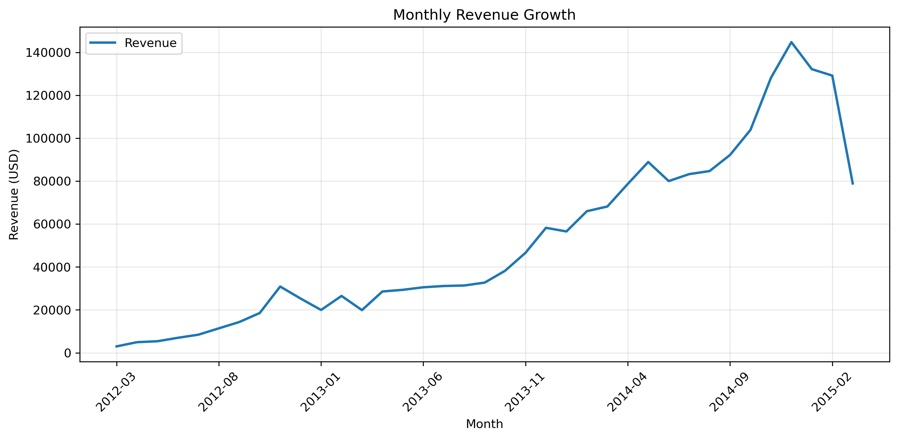
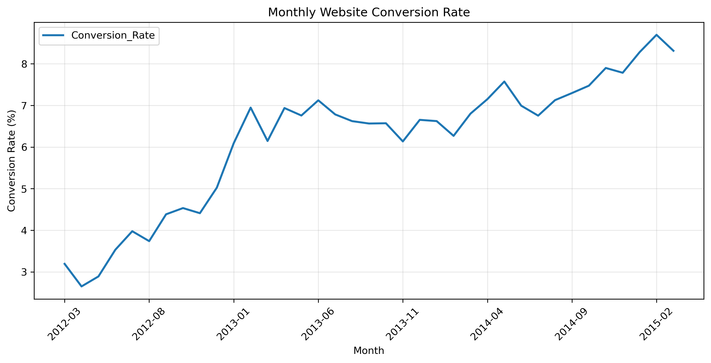
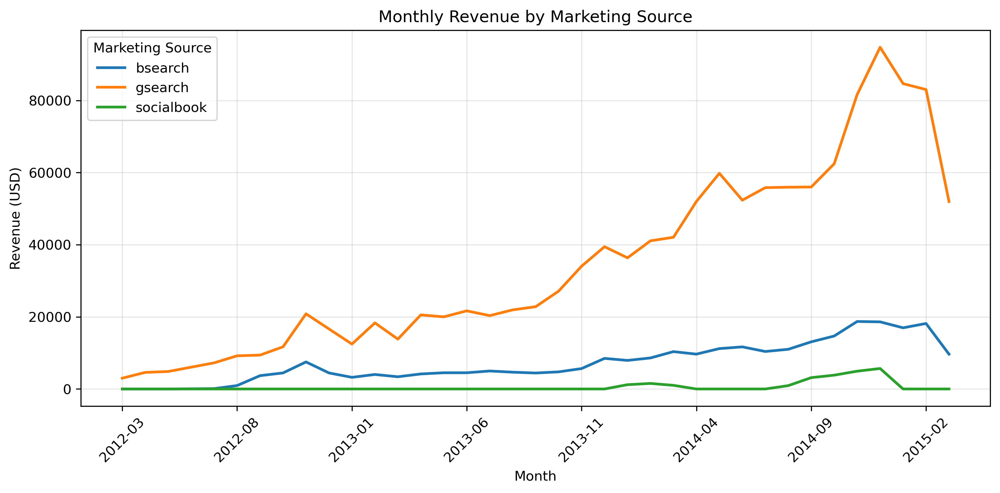
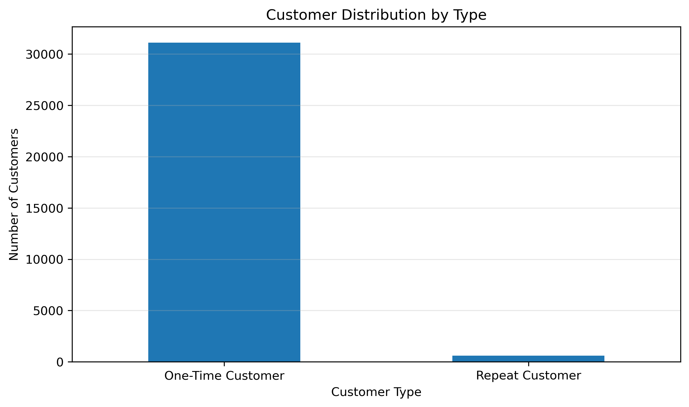
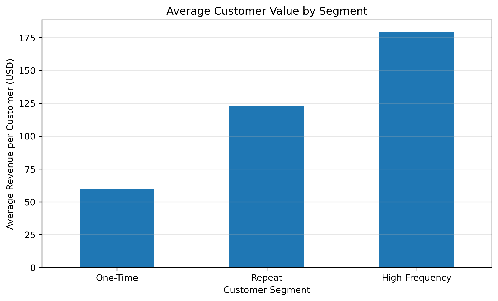
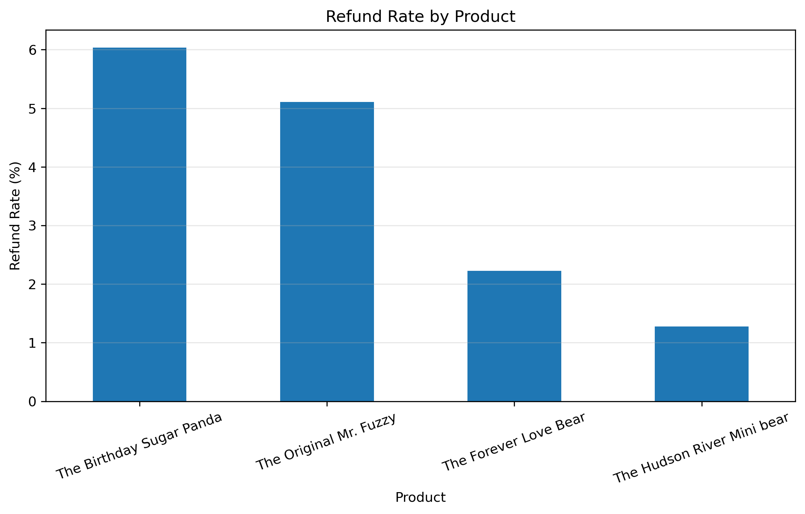

# Toy Store E-Commerce Data Analysis

An end-to-end exploratory analysis of a toy-store e-commerce business. This project turns transactional, web-session, marketing, product, and refund data into practical recommendations for growth, marketing efficiency, retention, and product management.

## Project Overview

The analysis evaluates business performance from March 2012 through March 2015. It combines order-level and website-session data to understand how traffic, conversion, product mix, acquisition channels, customer behavior, and refunds shaped revenue.

## Business Objectives

- Measure sales, profitability, and growth trends.
- Identify the products driving revenue and margin.
- Evaluate website conversion and marketing-channel performance.
- Understand customer purchase frequency and retention opportunity.
- Assess refund patterns and product-level return risk.

## Dataset Overview

The project uses the supplied Maven Fuzzy Factory e-commerce CSV files in `data/raw/`:
Source: Maven Analytics — Toy Store E-Commerce Database
License: Public Domain

- `orders.csv` — 32,313 orders, including order value, cost, customer, and session identifiers.
- `order_items.csv` — 40,025 line items used for product-level analysis.
- `website_sessions.csv` — 472,871 sessions with traffic-source and campaign attributes.
- `website_pageviews.csv` — 1,188,124 pageviews.
- `products.csv` — 4 products.
- `order_item_refunds.csv` — 1,731 refunded items.
- `maven_fuzzy_factory_data_dictionary.csv` — field definitions.

## Tools & Technologies

- Python
- pandas and NumPy for data preparation and analysis
- Matplotlib and Seaborn for visualization
- Jupyter Notebook

## Project Structure

```text
E-Commerce-Data-Analysis/
├── data/
│   └── raw/
├── notebooks/
│   └── Maven_Ecommerce_Analysis.ipynb
├── portfolio_charts/
│   ├── customer_distribution.png
│   ├── customer_value_by_segment.png
│   ├── monthly_conversion_rate.png
│   ├── monthly_revenue_growth.png
│   ├── refund_rate_by_product.png
│   └── revenue_by_marketing_source.png
├── .gitignore
├── requirements.txt
└── README.md
```

## Methodology

1. Loaded the six operational datasets and data dictionary.
2. Checked data types, null values, duplicates, and primary-key uniqueness.
3. Converted date fields and created monthly, yearly, channel, campaign, product, refund, and customer-segment views.
4. Calculated KPIs including revenue, COGS, profit, conversion rate, revenue share, refund rate, and average customer value.
5. Visualized trends and translated findings into business recommendations.

## Key Findings

- The business generated **$1.94M** in revenue from **32,313 orders**, with **$1.22M** in profit, a **62.74%** profit margin, and a **$59.99** average order value.
- Revenue grew from **$129.3K in 2012** to **$1.08M in 2014**. The monthly peak was **$144.8K in December 2014**; 2015 is partial-year data and should not be compared directly with full years.
- Overall website conversion was **6.83%**. Monthly conversion improved from **3.19% in March 2012** to **8.31% in March 2015**, peaking at **8.70% in February 2015**.
- **gsearch** drove **$1.28M (81.43%)** of attributed marketing-source revenue and 21,333 orders. **bsearch** had the strongest source conversion rate at **7.19%**; together, the two search sources contributed about **98.6%** of attributed revenue.
- **The Original Mr. Fuzzy** generated **$1.21M (62.47%)** of product revenue, creating concentration risk. **The Birthday Sugar Panda** had the highest product margin (**68.49%**) but also the highest refund rate (**6.04%**).
- Of **31,696 customers**, **31,105** purchased once. Only **591** purchased more than once. Customers with exactly two orders averaged **$123.34** in revenue, versus **$59.93** for one-time customers; customers with three orders averaged **$179.58**.
- There were **1,731** refunded items worth **$85.3K**, an overall item refund rate of **4.32%**.

## Business Recommendations

1. **Prioritize retention.** Use post-purchase journeys, personalized offers, and product recommendations to increase repeat purchasing; repeat customers deliver materially higher value per customer.
2. **Protect and optimize search acquisition.** Continue scaling gsearch for reach and evaluate incremental investment in bsearch for its stronger conversion efficiency.
3. **Reduce product concentration.** Maintain the flagship Mr. Fuzzy product while promoting the higher-margin products to diversify revenue.
4. **Investigate Sugar Panda refunds.** Review product quality, customer expectations, product pages, and fulfillment for the product with the highest return rate.
5. **Manage revenue with both traffic and conversion metrics.** The highest conversion month was not the highest-revenue month, so acquisition volume and conversion efficiency should be monitored together.

## Selected Visualizations

### Monthly Revenue Growth



### Monthly Website Conversion Rate



### Revenue by Marketing Source



### Customer Distribution by Type



### Average Customer Value by Segment



### Refund Rate by Product



## Conclusion

The business achieved strong growth through increasing traffic and improving conversion, with search marketing—especially gsearch—as the principal acquisition engine. The largest opportunities are to improve retention, diversify beyond the flagship product, and diagnose the refund risk associated with The Birthday Sugar Panda. Together, these actions can support more resilient and profitable growth.
